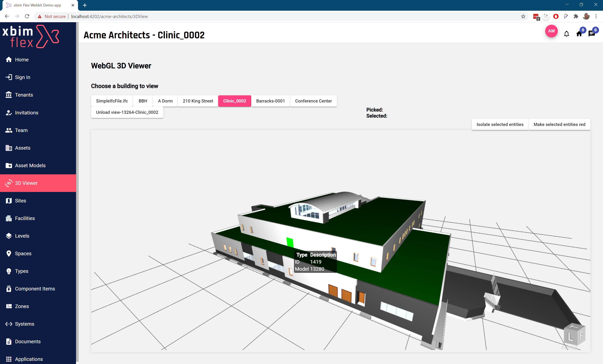
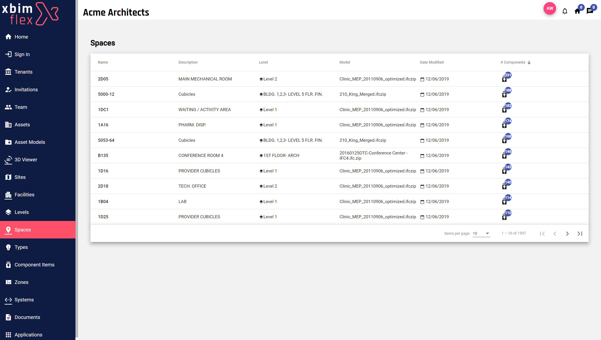

# Xbim Flex Webkit demo

This sample project demonstrates how the xbim Flex Webkit Angular libraries can be used to
quickly build web solutions powered by the xbim Flex Platform to work with BIM data in the
IFC OpenBIM format.

## Getting Started

This is an [Angular 9](https://angular.io/docs) front-end web project, demonstrating how to use the
xbim Flex API in an Angular application.

## Pre-requisites

Make sure you have `node` and `npm` [installed ](https://docs.npmjs.com/downloading-and-installing-node-js-and-npm).

To help understand the redux state employed in webkit to manage data and User interface we recommend installing
a Redux devtools addin to your browser. E.g. https://github.com/zalmoxisus/redux-devtools-extension

### Install

1. Run `cd flex-demo`
1. Run `npm install` to install the dependencies

### Running

- Run `ng serve -o` to run the Angular demo app and launch in your default browser.

> Note: the application runs off https://localhost:4202/ by default and we have not provided any SSL setup in this sample for simplicity.

## Functionality

This demo app shows how you can use xbim Flex and the xbim Flex Angular Webkit to :

- Upload new IFC models and convert to wexbim
- Visualise 3D BIM models
  - Load multiple Wexbim models into a single scene (Federation)
  - Interact with 3D models
  - Show interactive tooltips
  - Selecting and styling
- Query and filter the data in BIM models through a number of different 'domains'
  - E.g. [Levels](flex-demo/src/app/components/level-index/level-index.component.ts), [Spaces](flex-demo/src/app/components/space-index/space-index.component.ts), [Components](flex-demo/src/app/components/component-item-index/component-item-index.component.ts), [Documents](flex-demo/src/app/components/document-index/document-index.component.ts) etc.
  - Navigate between domains - e.g. find the spaces that components are in or vice-versa
  - Query across models and assets - portfolio analysis
  - Work with an interactive grid to select single and multiple records from models

### Technical Functionality

The Flex Webkit handles a lot of the 'heavy-lifting' to boot-strap a Single Page Application. For example

- Authenticating users with the service automatically using an _OAuth2_ PKCE code flow
  - You can set up an account for free, and use a 3rd party login such as Google or Office365 for convenience
  - Token management, including session management and token renewal is taken care of automatically
  - Bearer tokens are automatically sent along with relevant API calls
- Routing and switching between multiple 'tenancies'
  - A Flex Tenant is security boundary to separate one customer from another.
  - A Flex user account may be able to access multiple tenants, and can have different access rights in each one
- Make use of application 'state-management' patterns with [NGXS](https://www.ngxs.io/), for simple Redux-like state systems
- Providing data-bound UI components such as a grid to display results in
- Real-time messaging
- Build a modular lazy-loaded application around Flex

## TODO - Coming soon

Demonstrate more of the Flex platform's functionality in the webkit. E.g.

- [ ] Extra 3D viewer functionality
  - Navigation modes, including 1st person
  - Camera modes (Perspective / Orthoganal)
  - Sectioning and cut-planes
  - Taking & Restore snapshots
  - Picking, Zooming & isolating
  - Transparency modes
  - Animations
  - Plugins
- [x] Uploading IFC models & monitoring their import
- [ ] Working with the xbim Grid for tabular data
- [ ] Working with Schedules - tabular model data
- [ ] Associating data with models. E.g. tag document to a space
- [ ] Adding and Editing properties. E.g. Classifying components, renaming spaces.
- [ ] Creating new Tenants
- [ ] Inviting new users / Team mates
- [ ] Access control and Role-based security
- [ ] Spatial querying with Footprints
- [ ] Version control
- [ ] Working with the Comms API to send messages
- [ ] Build, deploy and manage your own Client application for your customers

## Questions
